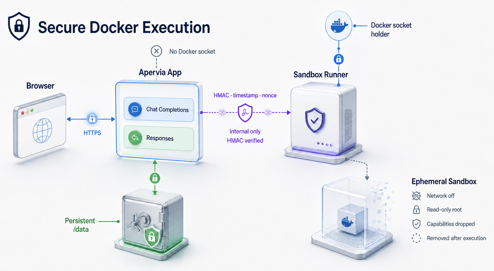
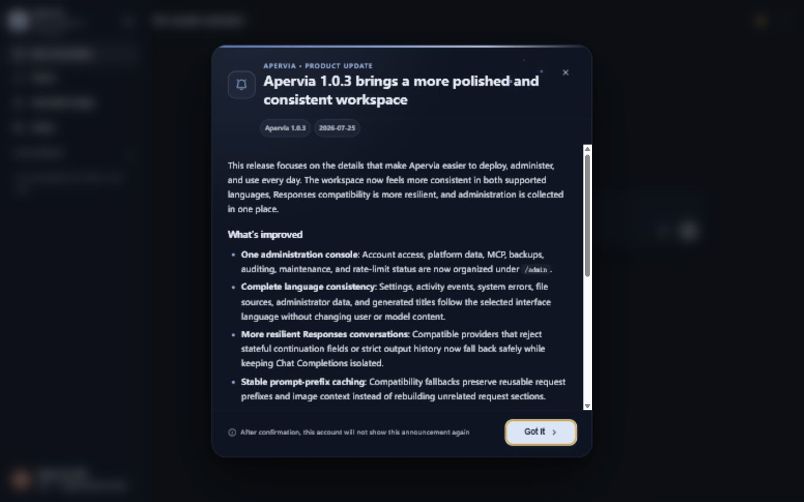

# Apervia

<p align="right">
  <strong>English</strong> | <a href="README.zh-CN.md">简体中文</a>
</p>

<p align="center">
  
</p>

<p align="center"><strong>A Docker-native AI workspace for individuals and teams</strong></p>

<p align="center">
  Bring conversations, knowledge bases, files, models, and MCP tools into one maintainable private workspace, with isolated sandbox execution for code and document tasks.
</p>

<p align="center">
  <a href="#what-apervia-brings-together">Overview</a> ·
  <a href="#product-tour">Product tour</a> ·
  <a href="#install-and-verify">Install</a> ·
  <a href="#enable-the-isolated-sandbox">Sandbox</a> ·
  <a href="#documentation">Documentation</a> ·
  <a href="#production-checklist">Production checklist</a>
</p>

<p align="center">
  <a href="https://github.com/wdyh1314520-gif/apervia-open-source/actions/workflows/publish-images.yml"></a>
  
  
  
</p>

> Apervia is open-source software released under the [MIT License](LICENSE).


## What Apervia brings together

| Area | What you get | Maintained boundary |
| --- | --- | --- |
| Conversations | Persistent and temporary chats, search, sharing, image context, and activity details | Account-owned history and data |
| Model APIs | Independent Chat Completions and Responses profiles, streaming, reasoning, and tool calls | The two protocols never reuse each other's request pipeline |
| Knowledge and files | Conversation attachments, reusable library documents, knowledge bases, previews, and generated artifacts | Storage, ownership, and quotas are enforced on the server |
| MCP | Server directory, OAuth + PKCE, encrypted credentials, tool discovery, risk levels, and per-call authorization | Private-address checks and explicit permission levels remain active |
| Sandbox | Temporary code and document execution with Playwright, LibreOffice, OCR, PDF, and Office tooling | The App has no Docker socket; task containers are isolated and short-lived |
| Administration | Account approval, roles, sessions, quotas, files, knowledge bases, MCP, trash, backups, auditing, maintenance, and rate limits | All administration is collected under `/admin` |
| Delivery | Compose deployment, amd64 and arm64 images, health checks, SBOM, provenance, and release automation | App and Sandbox images are versioned together |

## Architecture and security boundaries



The App mounts only the persistent data volume. The Docker socket is exposed only to the internal `sandbox-runner`, which publishes no host port. Regular execution containers have networking disabled and can access only the temporary volume for the current task. Each container and temporary volume is removed when execution finishes.

## Product tour

After sign-in, model selection, conversation input, file access, and conversation history are available in one workspace:


Model APIs, Chat Completions, Responses, web access, MCP, image, and account settings are organized by function:


For complete usage instructions, see the [User Guide](docs/USER_GUIDE.md). For account approval, permissions, quotas, backups, and auditing, see the [Administrator Guide](docs/ADMIN_GUIDE.md).

Account access and platform operations are managed from one administration console:


Each image release includes a bilingual in-app announcement. Acknowledgement belongs to the account, while closing the card only dismisses it for the current page:



## Install and verify

### Choose the deployment scope

| Scope | Services | Recommended for |
| --- | --- | --- |
| App only | `app` | Conversations, models, files, knowledge bases, web search, and MCP without local code execution |
| App + Sandbox | `app`, `sandbox-runner`, execution image | Isolated code, browser, Office, PDF, OCR, and document-generation tasks |

Start with the App only. Enable the Sandbox after sign-in and model configuration work correctly.

### 1. Prepare the host

- Docker Engine 24+ or Docker Desktop
- Docker Compose v2
- At least 8 GB of memory is recommended; 16 GB is recommended when sandbox and document processing are enabled

```bash
git clone https://github.com/wdyh1314520-gif/apervia-open-source.git
cd apervia-open-source
cp .env.example .env
```

On Windows PowerShell, copy the template with:

```powershell
Copy-Item .env.example .env
```

If the repository or GHCR package is private, sign in first:

```bash
echo "$GITHUB_TOKEN" | docker login ghcr.io -u YOUR_GITHUB_USERNAME --password-stdin
```

### 2. Configure the App

Edit `.env`:

```dotenv
APP_IMAGE=ghcr.io/wdyh1314520-gif/apervia-open-source:latest
APP_PULL_POLICY=always
SANDBOX_DOCKER_IMAGE=ghcr.io/wdyh1314520-gif/apervia-open-source-sandbox:latest
APP_BIND_IP=127.0.0.1
TRUST_PROXY_X_FOR=0
APP_HOST_PORT=8002
AUTH_SIGNUP_ENABLED=1
AUTH_DEFAULT_ROLE=pending
SANDBOX_TOOLS_ENABLED=0
```

Keep `APP_BIND_IP=127.0.0.1` for local-only use. For LAN access, change it to a specific interface address or `0.0.0.0`, and configure a firewall, reverse proxy, and TLS at the same time.

Keep `TRUST_PROXY_X_FOR=0` unless the App is bound to `127.0.0.1` and exactly one trusted reverse proxy is its only ingress. In that topology, set it to `1`. Never enable it when exposing the App directly on `0.0.0.0`.

### 3. Start and verify the App

```bash
docker compose pull app
docker compose up -d app
docker compose ps
docker compose logs --tail 100 app
curl --fail http://127.0.0.1:8002/api3/health/ready
```

Open [http://127.0.0.1:8002](http://127.0.0.1:8002). On a new data volume:

1. Register the first real account. It becomes the initial administrator.
2. Sign in and open **Settings → API** to save a Chat Completions or Responses profile.
3. Add or synchronize a model, select it at the top of the workspace, and send a short test message.
4. Open **Administration** from the account menu, or go to `/admin`, to review accounts and system status.

A new data volume does not include, simulate, or import any account automatically. Later registrations remain pending until an administrator approves them, unless you intentionally change `AUTH_DEFAULT_ROLE`.

## Enable the isolated sandbox

Generate a Runner shared secret and add it to `.env`:

```bash
python -c "import secrets; print(secrets.token_hex(32))"
```

```dotenv
SANDBOX_TOOLS_ENABLED=1
SANDBOX_RUNNER_SECRET=REPLACE_WITH_THE_GENERATED_VALUE
```

On native Linux, also set `DOCKER_SOCKET_GID` to the group ID of the Docker socket:

```bash
stat -c %g /var/run/docker.sock
docker compose --profile sandbox pull app sandbox-runner sandbox-image
docker compose --profile sandbox up -d app sandbox-runner
docker compose --profile sandbox ps
docker compose --profile sandbox logs --tail 100 sandbox-runner
```

The `sandbox-image` service pulls the execution image without starting a persistent container. When the sandbox is disabled, keep `SANDBOX_TOOLS_ENABLED=0`; neither Chat nor Responses will receive tool definitions that cannot be executed.

Verify these boundaries after startup:

- `app` is healthy and does not mount `/var/run/docker.sock`.
- `sandbox-runner` is healthy, publishes no host port, and is reachable only on the internal network.
- App and Sandbox image tags use the same release version.

## Documentation

The detailed documentation listed below is maintained in English.

| Document | Description |
| --- | --- |
| [Quick Start](docs/QUICKSTART.md) | Installation, the first administrator, local builds, and basic checks |
| [User Guide](docs/USER_GUIDE.md) | Signed-in workspace, models, files, knowledge bases, MCP, and sandbox usage |
| [Administrator Guide](docs/ADMIN_GUIDE.md) | Account approval, permissions, platform data, backups, auditing, and rate limits |
| [Integration Guide](docs/INTEGRATIONS.md) | MCP, SearXNG, Ollama, and host services |
| [Operations Guide](docs/OPERATIONS.md) | Backup, restore, upgrade, rollback, logs, and troubleshooting |
| [Release Guide](docs/RELEASE_GUIDE.md) | Changes, pull requests, release notes, image publishing, upgrades, and rollback |
| [Runbook](RUNBOOK.md) | Code-level runtime boundaries and advanced troubleshooting |
| [Security Policy](SECURITY.md) | Vulnerability reporting and supported versions |
| [Contributing Guide](CONTRIBUTING.md) | Development, verification, and commit conventions |

## Local builds and verification

Prefer reusing published images. To develop the current source code locally:

```bash
docker build -t apervia:local .
docker build -t apervia-sandbox:local docker/sandbox-prod
```

Change the image references in `.env` to the local tags and set `APP_PULL_POLICY=never`. Before submitting changes, run:

```bash
python -m unittest discover -s tests -p "test_*.py"
python -m compileall -q app3.py app3_parts sandbox_runner mcp_client tests
docker compose --profile sandbox config --quiet
docker compose --profile sandbox-build config --quiet
```

## Data and upgrade principles

- All runtime data is stored in the Compose named volume `apervia_app3_data`.
- Back up the data volume before every upgrade and retain the complete image tag for the previous version.
- Back up the MCP database `/data/mcp_server_store.db` together with its key `/data/mcp_token.key`.
- Do not run `docker compose down -v` unless you explicitly intend to permanently delete all runtime data.
- Rolling back an image does not roll back the database format. If a release includes a data migration, restore the matching backup according to the release notes.

For deployments published from another repository, use a versioned image reference such as:

```dotenv
APP_IMAGE=ghcr.io/<owner>/<repository>:1.0.3
```

A standard backup archive may be named `apervia-data.tar.gz`. Restoring overwrites the current volume data, so back up the current state and verify the target volume name first.

See the [Operations Guide](docs/OPERATIONS.md) for the complete procedure.

## Production checklist

- Pin both images to the same complete release tag instead of following `latest` indefinitely.
- Keep the App on `127.0.0.1` behind one trusted reverse proxy whenever possible; enable `TRUST_PROXY_X_FOR=1` only for that exact topology.
- Add HTTPS, firewall rules, request-size limits, and an external backup schedule before public exposure.
- Back up `apervia_app3_data`, including `/data/mcp_server_store.db` and `/data/mcp_token.key`, and test a restore.
- Keep at least one active administrator and review pending, disabled, and deleted accounts regularly.
- Verify sign-in, a real model conversation, file access, MCP, and one Sandbox task after every upgrade.

## Common startup checks

| Symptom | First check |
| --- | --- |
| The page does not open | Run `docker compose ps`, inspect `docker compose logs --tail 100 app`, and call the readiness endpoint |
| No model is available | Save the correct API type, base URL, and key; then add or synchronize models |
| A host service is unreachable | Use `host.docker.internal`, not the container's `127.0.0.1`, and verify the host bind address and firewall |
| Sandbox tools are missing | Confirm `SANDBOX_TOOLS_ENABLED=1`, matching Runner secrets, a healthy Runner, and a locally available Sandbox image |
| A new user cannot enter | Approve the pending account under `/admin` |

## Current limitations

- The current design supports a single App instance and does not support direct horizontal scaling.
- The repository does not include domain, reverse proxy, TLS, or automatic certificate configuration.
- Sandbox features depend on the host Docker Engine and are disabled by default.
- Before exposing the service externally, configure access control, firewall rules, HTTPS, backups, and a tested recovery procedure.

## Contributing

Before submitting an issue or change, read the [Contributing Guide](CONTRIBUTING.md) and [Code of Conduct](CODE_OF_CONDUCT.md). Report security issues privately according to the [Security Policy](SECURITY.md); do not disclose vulnerability details publicly.
