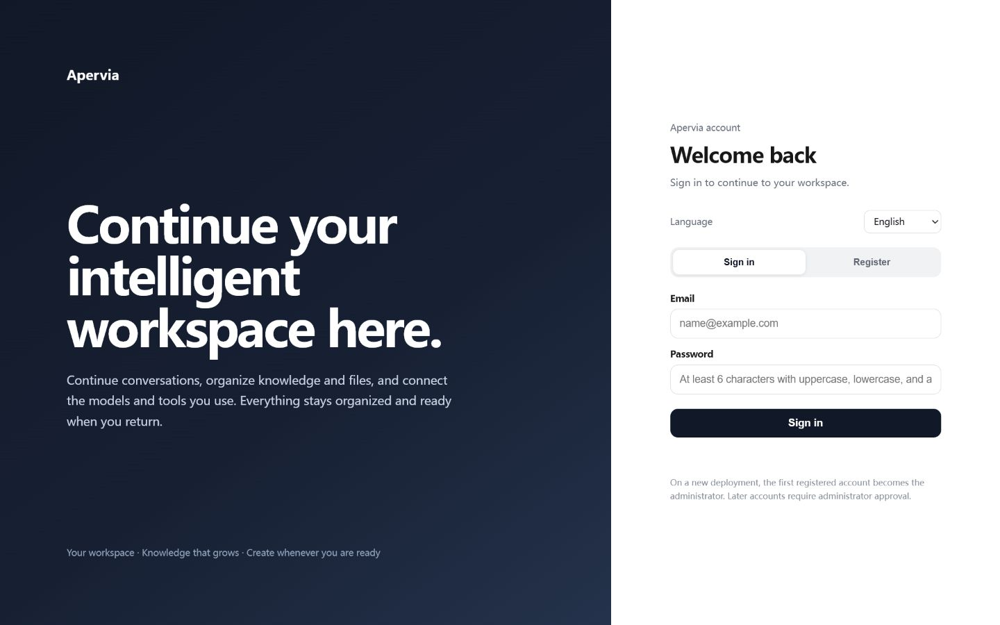
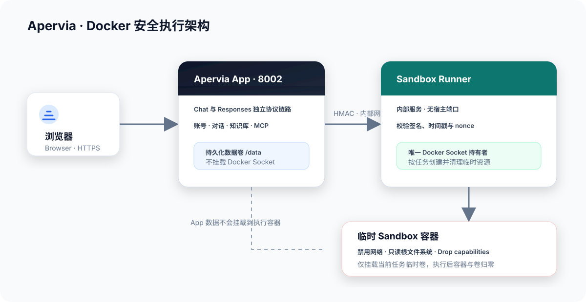
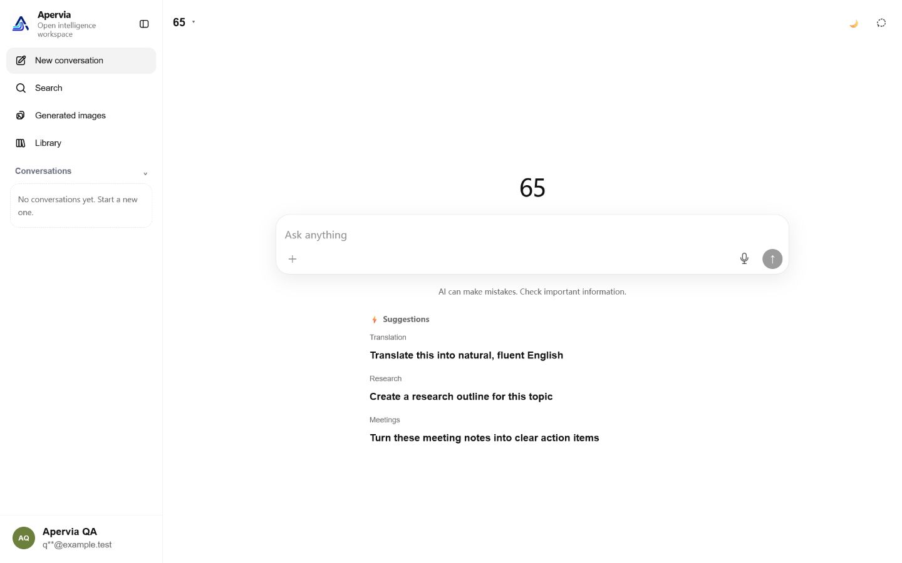
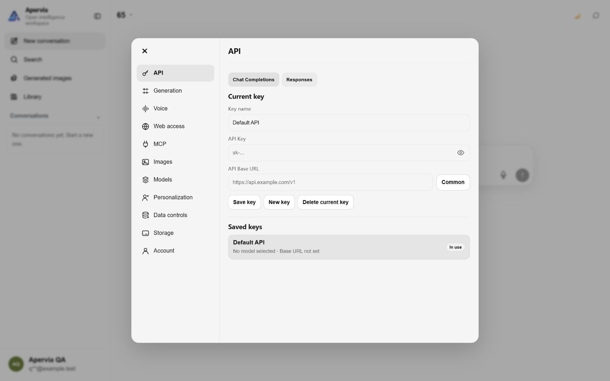

# Apervia

<p align="right">
  <a href="README.md">English</a> | <strong>简体中文</strong>
</p>

<p align="center">
  
</p>

<p align="center"><strong>面向个人与团队的 Docker 原生智能工作空间</strong></p>

<p align="center">
  将对话、知识库、文件、模型与 MCP 工具统一到可持续维护的私有工作空间中，并通过隔离沙盒安全执行代码和文件任务。
</p>

<p align="center">
  <a href="https://github.com/wdyh1314520-gif/apervia-open-source/actions/workflows/publish-images.yml"></a>
  
  
  
</p>

> Apervia 是依据 [MIT License](LICENSE) 发布的开源软件。



## 核心能力

- **统一工作空间**：持续管理对话、知识库、上传文件、生成结果与账号数据。
- **双协议模型链路**：Chat Completions 与 Responses 保持独立请求、流式处理和工具调用边界，避免协议互串。
- **MCP 集成**：支持外部 MCP Server、OAuth + PKCE、工具扫描、风险分级与逐次授权；凭据在服务端加密保存。
- **隔离沙盒执行**：App 不接触 Docker Socket；独立 Runner 为每次任务创建断网、只读根文件系统、最小权限的临时容器。
- **文档与多媒体处理**：内置 Playwright、LibreOffice、OCR、PDF 与常用 Office 文档处理能力。
- **平台治理**：提供账号审核、配额、文件、知识库、回收站、备份与审计管理入口。
- **Docker 原生交付**：App 与 Sandbox 镜像均由 GitHub Actions 构建并发布 `linux/amd64`、`linux/arm64` 清单。

## 架构与安全边界



App 只挂载持久化数据卷。Docker Socket 仅提供给内部 `sandbox-runner`，Runner 不映射宿主端口；普通执行容器强制禁网，只能访问当前任务的临时卷，执行完成后容器和临时卷都会清理。

## 产品界面

登录后，模型选择、对话输入、文件入口和历史会话集中在同一个工作区：



模型 API、Chat Completions、Responses、联网、MCP、图片和账户设置按功能分组管理：



完整操作请阅读 [用户指南](docs/USER_GUIDE.md)；账号审核、权限、配额、备份和审计请阅读 [管理员指南](docs/ADMIN_GUIDE.md)。

## 5 分钟启动

### 1. 准备环境

- Docker Engine 24+ 或 Docker Desktop
- Docker Compose v2
- 建议至少 8 GB 内存；启用沙盒和文档处理时建议 16 GB

```bash
git clone https://github.com/wdyh1314520-gif/apervia-open-source.git
cd apervia-open-source
cp .env.example .env
```

如果仓库或 GHCR Package 为私有，请先登录：

```bash
echo "$GITHUB_TOKEN" | docker login ghcr.io -u YOUR_GITHUB_USERNAME --password-stdin
```

### 2. 配置镜像

编辑 `.env`：

```dotenv
APP_IMAGE=ghcr.io/wdyh1314520-gif/apervia-open-source:latest
SANDBOX_DOCKER_IMAGE=ghcr.io/wdyh1314520-gif/apervia-open-source-sandbox:latest
APP_BIND_IP=127.0.0.1
APP_HOST_PORT=8002
```

仅本机使用时保持 `APP_BIND_IP=127.0.0.1`。需要局域网访问时再改为明确的网卡地址或 `0.0.0.0`，并同时配置防火墙、反向代理和 TLS。

### 3. 启动 App

```bash
docker compose pull app
docker compose up -d app
docker compose ps
curl --fail http://127.0.0.1:8002/api3/health/ready
```

打开 [http://127.0.0.1:8002](http://127.0.0.1:8002)。全新数据卷不会预置、模拟或自动导入任何账号；第一个真实注册账号自动成为管理员，之后的新账号默认需要管理员审核。

### 4. 启用隔离沙盒（可选）

先生成 Runner 共享密钥并写入 `.env`：

```bash
python -c "import secrets; print(secrets.token_hex(32))"
```

```dotenv
SANDBOX_TOOLS_ENABLED=1
SANDBOX_RUNNER_SECRET=替换为上一步生成的值
```

原生 Linux 还需把 Docker Socket 属组写入 `DOCKER_SOCKET_GID`：

```bash
stat -c %g /var/run/docker.sock
docker compose --profile sandbox pull app sandbox-runner sandbox-image
docker compose --profile sandbox up -d app sandbox-runner
docker compose --profile sandbox ps
```

未启用时保持 `SANDBOX_TOOLS_ENABLED=0`，Chat 与 Responses 都不会收到不可执行的沙盒工具定义。

## 文档

| 文档 | 内容 |
| --- | --- |
| [快速开始](docs/QUICKSTART.md) | 安装、首个管理员、本地构建与基础检查 |
| [用户指南](docs/USER_GUIDE.md) | 登录后的工作区、模型、文件、知识库、MCP 与沙盒 |
| [管理员指南](docs/ADMIN_GUIDE.md) | 账号审核、权限、平台数据、备份、审计与限流 |
| [集成指南](docs/INTEGRATIONS.md) | MCP、SearXNG、Ollama 与宿主机服务 |
| [运维指南](docs/OPERATIONS.md) | 备份、恢复、升级、回滚、日志与故障排查 |
| [发布指南](docs/RELEASE_GUIDE.md) | 修改、PR、版本说明、镜像发布、升级与回滚 |
| [运行手册](RUNBOOK.md) | 代码级运行边界和深入排障 |
| [安全策略](SECURITY.md) | 漏洞报告与受支持版本 |
| [贡献指南](CONTRIBUTING.md) | 开发、验证与提交规范 |

## 本地构建与验证

优先复用已发布镜像。需要开发当前源码时：

```bash
docker build -t apervia:local .
docker build -t apervia-sandbox:local docker/sandbox-prod
```

将 `.env` 中的镜像改为本地标签，并设置 `APP_PULL_POLICY=never`。提交前运行：

```bash
python -m unittest discover -s tests -p "test_*.py"
python -m compileall -q app3.py app3_parts sandbox_runner mcp_client tests
docker compose --profile sandbox config --quiet
docker compose --profile sandbox-build config --quiet
```

## 数据与升级原则

- 所有运行数据统一写入 Compose 命名卷 `apervia_app3_data`。
- 升级前必须备份数据卷，并保留上一版完整镜像标签。
- MCP 数据库 `/data/mcp_server_store.db` 与密钥 `/data/mcp_token.key` 必须成套备份。
- 不要执行 `docker compose down -v`，除非明确要永久删除全部运行数据。
- 镜像回滚不会自动回滚数据库格式；涉及数据迁移时必须结合发布说明恢复对应备份。

发布到其他仓库时，版本化镜像写法为：

```dotenv
APP_IMAGE=ghcr.io/<owner>/<repository>:1.0.1
```

标准备份文件可命名为 `apervia-data.tar.gz`。恢复会覆盖当前卷内数据，执行前必须先备份当前状态并核对目标卷名。

完整操作步骤见 [运维指南](docs/OPERATIONS.md)。

## 当前边界

- 当前按单 App 实例设计，不支持直接横向扩容。
- 仓库不内置域名、反向代理、TLS 或自动证书配置。
- 沙盒能力依赖宿主机 Docker Engine，并默认关闭。
- 对外开放前，请先完成访问控制、防火墙、HTTPS、备份和恢复演练。

## 参与维护

提交问题或改动前请阅读 [贡献指南](CONTRIBUTING.md) 与 [行为准则](CODE_OF_CONDUCT.md)。安全问题请按 [安全策略](SECURITY.md) 私下报告，不要公开披露漏洞细节。
