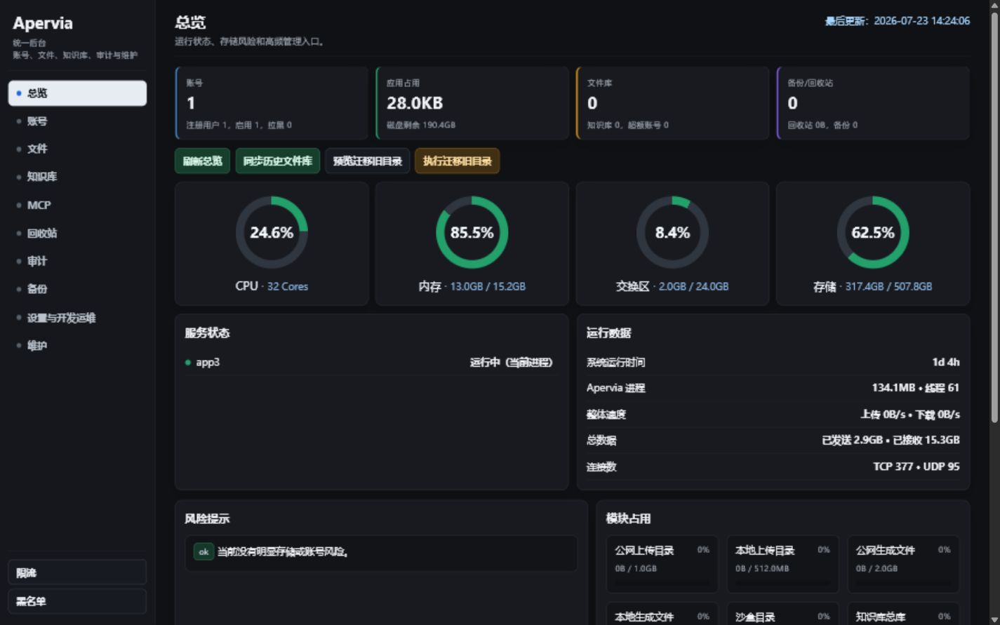

# Apervia Administrator Guide

The first real account registered on a new data volume automatically becomes an administrator. Administrators use the same sign-in entry point as regular users; there is no separate device cookie or local administrator password.

## 1. Administration entry points

| Entry point | Purpose |
| --- | --- |
| `/admin` | Users, roles, account status, and active sessions |
| `/platform-admin` | Account data, files, knowledge bases, MCP, trash, auditing, backups, and maintenance |
| `/storage-admin` | Storage usage and governance |
| `/rate-admin` | Request rate limits, security status, and administrative actions |
| `/blacklist-admin` | Compatibility view for legacy blacklist data |

Every entry point requires a valid administrator session. Do not expose the administration console to untrusted networks.

## 2. Users and permissions

Open `/admin`:

1. Review total users, administrators, regular users, pending approvals, and active sessions.
2. Newly registered accounts appear as **Pending** by default.
3. For a trusted account, change the role to **User**, change the status to **Active**, and save.
4. Grant **Administrator** only when administrative access is required; do not give regular users the administrator role.
5. Disable an account when unusual activity is detected and restore it only after confirming the cause.

Keep at least one administrator account that can sign in. Before changing your own role or status, confirm that another administrator can take over.

## 3. Unified platform administration

`/platform-admin` is organized by task:

- **Overview**: Accounts, application usage, file library, backups and trash, CPU, memory, and risk notices.
- **Accounts**: Quotas, data ownership, session summaries, and account status.
- **Files**: Registered files, historical-file synchronization, legacy-directory migration, and unregistered-file governance.
- **Knowledge bases**: Document indexes, parsing status, storage usage, and account ownership.
- **MCP**: Inspect the server-side MCP directory and enable, disable, disconnect, or delete entries. Plaintext tokens are never displayed.
- **Trash**: Restore files deleted by mistake or explicitly delete them permanently.
- **Audit**: Track administrative actions, failure reasons, and access sources.
- **Backups**: Create, filter, verify, and restore platform backups.
- **Settings and development operations**: Sandbox extension packages, live logs, and operational status.
- **Maintenance**: Run safe compaction and maintenance-library cleanup while the system is idle.

The **Users and permissions** button at the bottom of the sidebar opens `/admin` directly, so the address does not need to be entered manually.

## 4. Account and data governance

- Registered users should initiate their own account deletion. Administrators should not impersonate a user to start a normal deletion flow.
- For unregistered guest data, preview the scope on the Accounts page before entering the complete ownership identifier to confirm cleanup.
- Review file, knowledge-base, chat, and generated-content usage before changing account quotas.
- Reading chat content requires an audit reason. Access it only for legitimate operational or compliance needs.
- Preview a file migration before executing it, and verify the destination and item count.

Permanent deletion, backup restoration, bulk migration, and deep maintenance are high-risk operations. Create a backup first and confirm that no resource-intensive task is running.

## 5. Backup and restore

Backups in the platform administration console are suitable for application configuration and state. The host should also back up the complete `apervia_app3_data` volume regularly.

Before restoring:

1. Verify the backup time, reason, and integrity.
2. Back up the current data volume separately.
3. Ask users to stop writing data.
4. After restoration, restart the service and verify sign-in, conversations, files, knowledge bases, MCP, and sandbox execution.

Restore `/data/mcp_server_store.db` together with `/data/mcp_token.key`. See the [Operations Guide](OPERATIONS.md) for complete commands.

## 6. Security and rate limits

- Use `/rate-admin` to inspect rejected requests, concurrency, and rate-limit status.
- Do not disable SSRF private-address protections to work around incorrect MCP DNS configuration.
- The App must not mount the Docker socket; only the internal Runner may access it.
- Review administrator accounts, unusual sign-in IP addresses, audit records, and disk risks regularly.
- Use HTTPS for external access and minimize exposure through `APP_BIND_IP`, firewall rules, and the reverse proxy.

## 7. Recommended maintenance schedule

### Daily

- Check health endpoints, container status, error logs, and disk alerts.
- Process pending accounts and clearly failed tasks.

### Weekly

- Confirm that backups are created and readable.
- Review administrators, disabled accounts, MCP connections, and trash.
- Inspect storage growth, failed knowledge-base items, and unusual audit events.

### Before and after upgrades

- Create a volume-level backup and record the current image version before upgrading.
- Use the same version tag for the App and Sandbox images.
- After upgrading, verify the health endpoint, real sign-in, files, MCP, and sandbox execution.
- If a problem occurs, follow the [Release Guide](RELEASE_GUIDE.md) and [Operations Guide](OPERATIONS.md) to roll back.
