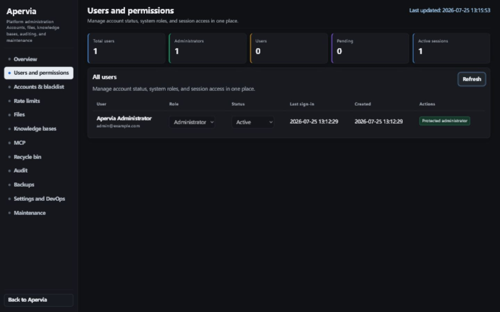

# Apervia Administrator Guide

The first real account registered on a new data volume automatically becomes an administrator. Administrators use the same sign-in page and account session as regular users. Apervia does not use a separate device cookie, local administrator password, or second administration login.

## 1. Open the unified administration console

Open **Administration** from the signed-in account menu, or visit `/admin` directly:

The console requires an active administrator session. If the session has expired, Apervia returns to the normal sign-in page and preserves `/admin` as the destination. Do not expose the console directly to an untrusted network.

Legacy administration URLs may redirect for upgrade compatibility, but `/admin` is the only documented and maintained user entry point.

## 2. Understand the twelve sections

| Section | Purpose | Typical checks |
| --- | --- | --- |
| Overview | Platform totals, resource status, storage, backups, and risk notices | Health, disk pressure, failed jobs, and recent changes |
| Users and permissions | Registration approval, roles, account status, and active sessions | Pending users, administrator count, and suspicious sessions |
| Accounts and blacklist | Account lifecycle, access restrictions, quotas, and owned data | Disabled or blacklisted users and deletion state |
| Rate limits | Endpoint thresholds, automatic cooldowns, and recent cooldown records | Repeated sign-in/API pressure and proxy address correctness |
| Files | Registered files, historical synchronization, migration previews, and unregistered-file governance | Ownership, orphaned files, and migration scope |
| Knowledge bases | Index status, document count, account ownership, and storage | Failed parsing, outdated indexes, and quota pressure |
| MCP | Server-side MCP entries and connection state | Unexpected servers, disabled tools, and authorization state |
| Recycle bin | Recoverable deleted files and permanent deletion | Retention age and restore target |
| Audit | Administrative actions, failure reasons, and access sources | Role changes, destructive actions, and denied operations |
| Backups | Create, filter, verify, and restore platform backups | Backup age, integrity, reason, and restore readiness |
| Settings and DevOps | Runtime status, Sandbox extension packages, and live logs | Image capabilities, package source, and current errors |
| Maintenance | Safe compaction and maintenance-library cleanup | Idle state, backup readiness, and expected reclaimed space |

Use the language selector in Apervia settings to switch the complete console between English and Simplified Chinese. Dynamic status, package-source labels, filters, and system errors follow the same language; user-created names and original content are not translated.

## 3. Approve users and protect administrator access

1. Open **Users and permissions**.
2. Review the registration time, role, status, and active sessions for the pending account.
3. Change the role to **User** and the status to **Active** only after confirming the account owner.
4. Grant **Administrator** only when the person needs platform-wide access.
5. Use **Disable** for temporary access suspension and **Blacklist** for an account that must not sign in until explicitly restored.

Apervia protects the last active administrator in both the interface and the server. That account cannot be disabled, blacklisted, downgraded, or deleted until another active administrator exists. This includes your own account; create and verify a replacement administrator before changing it.

## 4. Rate limits and trusted proxy addresses

The rate-limit page manages automatic request thresholds and temporary cooldowns. It is not a manual IP firewall and does not duplicate account disabling or blacklisting.

- **Limited** is the number of requests rejected by active thresholds.
- **Active cooldowns** are identities currently waiting for a cooldown to expire.
- **Cooldown records** are recent automatic events used for investigation.

A Docker gateway address is not automatically a real client address. Keep `TRUST_PROXY_X_FOR=0` for direct access. Set it to `1` only when the App listens on `127.0.0.1` and exactly one trusted reverse proxy is the sole ingress. Never trust forwarded addresses when the App is exposed directly through `0.0.0.0`.

## 5. Govern account data

- Review file, knowledge-base, chat, and generated-content usage before changing a quota.
- Reading chat content requires an audit reason. Access it only for legitimate operational or compliance work.
- Preview guest cleanup and file migration before execution; verify the complete owner identifier, destination, and item count.
- Registered users should start their own normal account deletion flow. Administrators should not impersonate them.
- Restore an item from the recycle bin before its retention period ends. Permanent deletion cannot be undone from Apervia.

Create a backup before permanent deletion, bulk migration, restore, or deep maintenance. Ask users to stop writing data while a restore or large migration is running.

## 6. MCP and Sandbox operations

The MCP page shows the server-side directory and connection state. Administrators may enable, disable, disconnect, or remove an entry, but plaintext bearer tokens are never displayed. Do not disable private-address protection to work around DNS or proxy configuration.

The Settings and DevOps page reports Sandbox image capabilities and packages. The App must never mount the Docker socket; only the internal `sandbox-runner` may access it. The Runner must publish no host port, and task containers remain short-lived, read-only, and network-disabled.

## 7. Backup and restore

Console backups cover application configuration and platform state. The host must also back up the complete `apervia_app3_data` volume.

Before restoring:

1. Verify the backup time, reason, format, and integrity result.
2. Create a separate backup of the current data volume.
3. Stop user writes and record the current App and Sandbox image tags.
4. Restore the selected backup and restart the services.
5. Verify sign-in, one model conversation, files, knowledge bases, MCP, and one Sandbox task.

Always restore `/data/mcp_server_store.db` together with `/data/mcp_token.key`. See the [Operations Guide](OPERATIONS.md) for volume-level commands and rollback guidance.

## 8. Recommended operating schedule

### Daily

- Check the readiness endpoint, container status, error logs, disk warnings, and active cooldowns.
- Process pending accounts and investigate clearly failed tasks.

### Weekly

- Confirm that backups are current and readable.
- Review administrators, disabled and blacklisted accounts, MCP connections, audit events, trash, and storage growth.
- Check failed knowledge-base items and unusual rate-limit records.

### Before and after upgrades

- Back up the data volume and record the exact App and Sandbox versions.
- Upgrade both images to the same release tag.
- Verify health, sign-in, a real model response, files, MCP, and Sandbox execution.
- If verification fails, follow the [Release Guide](RELEASE_GUIDE.md) and [Operations Guide](OPERATIONS.md) instead of mixing image versions.
